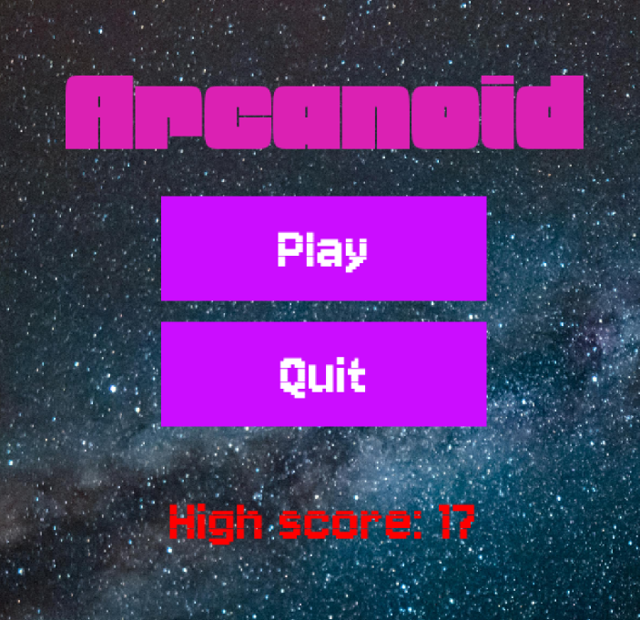
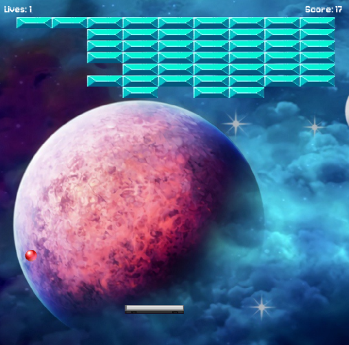
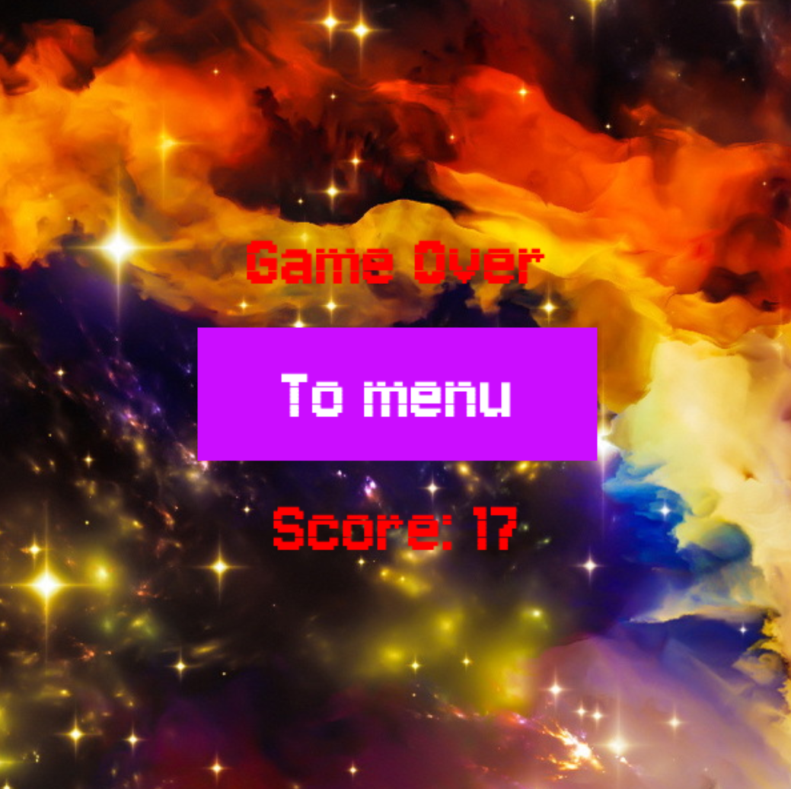

# Arcanoid

Клон игры Arkanoid, написанный на Pygame.

Игра имеет три состояния - меню, сама игра и Game Over. Игра заканчивается, когда у игрока заканчиваются жизни (он теряет их, вылетая за низ экрана). Периодически будут генерироваться новые платформы. Игра запоминает лучший результат и показывает его в меню.

## Программисты

- Полина Киселева - Team Lead, физика и логика игры
- Алина Сафиуллина - дизайн, оформление, UI (user interface)

## Скриншоты

## TODO

### Логика
#### Классы
  - [x] Класс шарика
  - [x] Класс платформы
  - [x] Класс платформы игрока
#### Прочее
  - [x] Отскакивание мячика от стен
  - [x] Случайное направление мячика в начале игры
  - [x] Подсчёт очков и жизней
  - [x] Перевод игры в Game Over когда жизни заканчиваются
  - [x] Отскакивание мячика от платформ (отскакивать по X если попадание в бок)
  - [x] Устранить застревание в текстурах платформ
  - [x] Отскакивание мячика от платформы игрока (отдельное для краёв)
  - [x] Появление новых платформ

### Меню и оформление
#### Шрифты
  - [x] Кнопка
  - [x] Game Over
  - [x] Название
#### Фоны
  - [x] Меню
  - [x] Игра
  - [x] Game Over
#### Музыка
  - [ ] Меню
  - [ ] Игра
  - [ ] Game Over
#### Звуки
  - [ ] Попадание шарика в платформу
  - [ ] Проигрыш
  - [ ] Отскакивание шарика от платформы игрока
#### Спрайты
  - [x] Шарик
  - [x] Платформа
  - [x] Платформа игрока
#### Код
  - [x] Класс кнопки
  - [x] Состояния игры и класс игры для их переключения
  - [x] Активация кнопки по отпусканию
  - [x] Кнопка начать игру
  - [x] Кнопка выход в меню
  - [x] Кнопка выход из игры

## Заимствования
 - [Фото меню](https://www.pexels.com/photo/milky-way-galaxy-during-nighttime-1252890/)
 - [Фото игры](https://www.pexels.com/photo/milky-way-galaxy-during-nighttime-1252890/)
 - [Фото Game Over](https://www.goodfon.com/abstraction/wallpaper-space-universe-stars-1207.html)
 - [Шрифты](https://fonts.google.com/)
 - [Спрайты платформ](https://www.google.com/url?sa=i&url=https%3A%2F%2Fwww.reddit.com%2Fr%2FPixelArt%2Fcomments%2F1cml47o%2Fmy_attempt_to_create_animated_sprites_for_another%2F&psig=AOvVaw2wYQKmz7RMIipFMWTGmqyM&ust=1733948561155000&source=images&cd=vfe&opi=89978449&ved=0CBgQ3YkBahcKEwiA1Pj1g56KAxUAAAAAHQAAAAAQBA)
